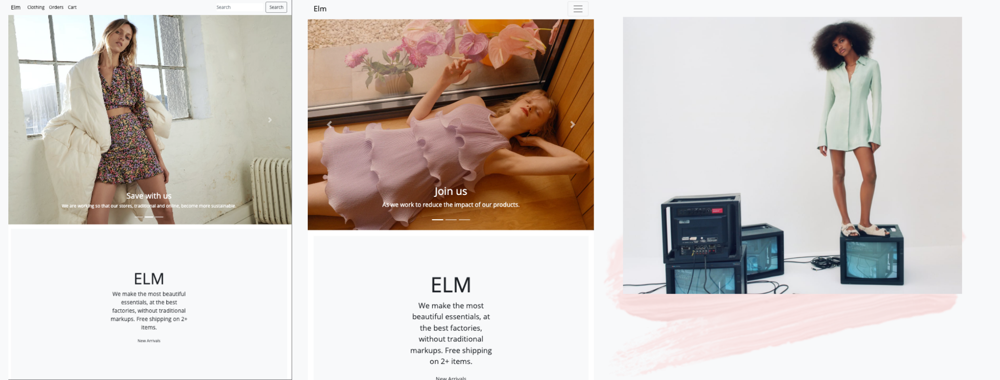
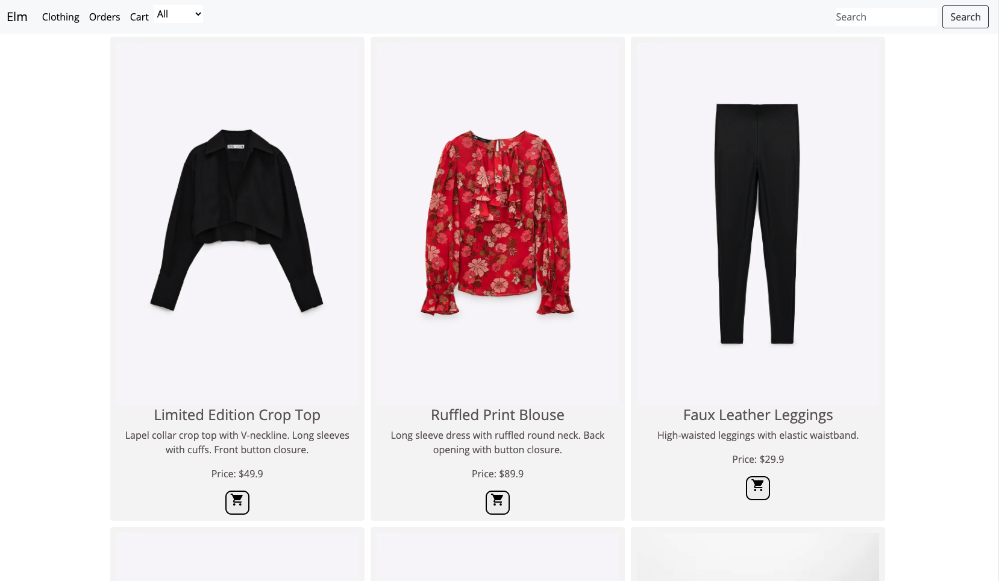
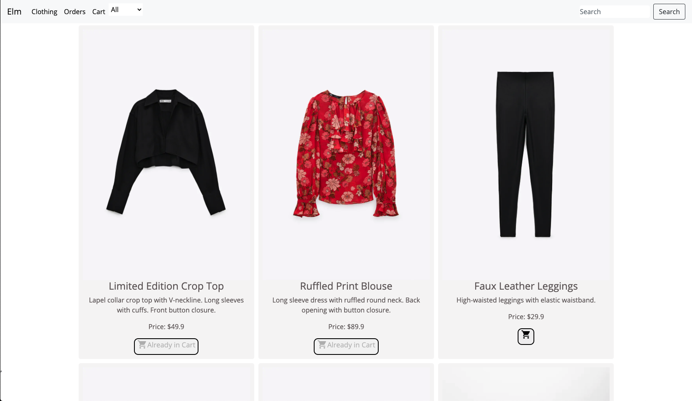

Elm
===========


About
--------------- 
Elm is a sustainable Women's E-Commerce app with a Sleek UI design. 

Demo
--------------- 






Installation
--------------- 
1. Install the [Rails backend](https://github.com/soxinmypocket/elm-backend)
2. Install [Node.js and npm](https://www.npmjs.com/get-npm)

    ```$ brew install node```
    
3. Clone this repo and cd into the directory
4. Install all dependencies

    ```$ npm install```

5. Make sure the Rails server is running and then run the app

    ```$ npm start```

Tech Stack
--------------- 
- Javascript
- React.js
- Ruby on Rails API
- PostgreSQL
- Bootstrap
- CSS

Tools Used
--------------- 
- React Router
- ActiveModelSerializers